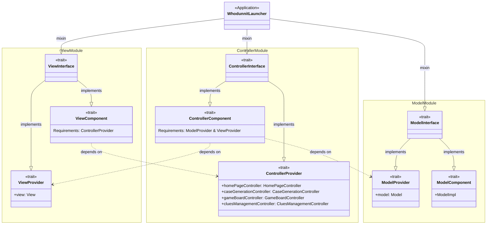
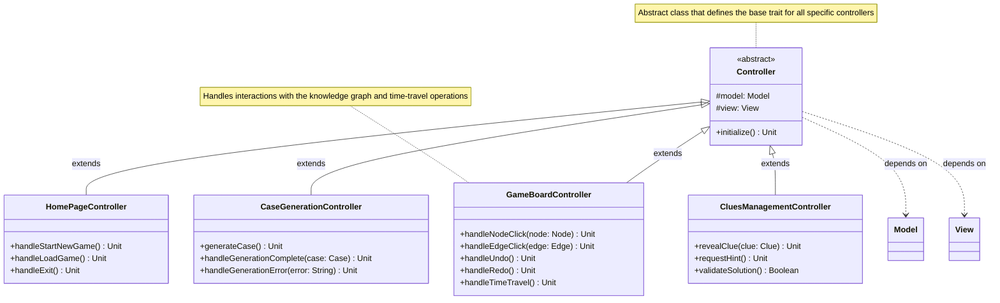
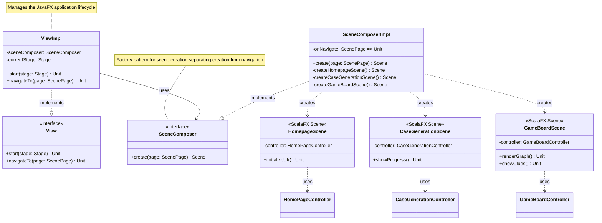

# High-Level Design

## Architectural Overview

The Whodunnit project has been designed following the principles of **functional programming** and **modular component architecture**, using the **Cake Pattern** as a fundamental pillar for dependency management and module composition. The architecture follows the **Model-View-Controller (MVC)** pattern, with a clear separation of responsibilities among the three main layers.



*Figure 1: Cake Pattern structure and dependencies between modules*

### Architectural Principles

The architecture adopts a rigorous **separation of responsibilities** among the three MVC layers, ensuring that each component has a well-defined domain of competence without overlaps. Dependency management is entirely entrusted to the **Cake Pattern**, a Scala architectural pattern that leverages self-types and trait mixins to achieve complete compile-time type-safety.

The design is driven by **immutability** as a fundamental principle: the game state is represented through immutable data structures that are transformed via copy-with operations, making it natural to implement features such as versioning, undo/redo, and time-travel. This choice integrates with a **type-driven** approach that leverages Scala 3's type system to ensure correctness and express domain invariants directly in the code. Component composability emerges naturally from these choices, allowing the construction of complex functionality by composing simpler, reusable units.

## Cake Pattern: The Heart of the Architecture

The **Cake Pattern** is a Scala architectural pattern that allows managing dependencies in a type-safe manner. In the Whodunnit project, this pattern has been implemented extensively and represents the backbone of the entire architecture.

### Cake Pattern Structure

Each application module (Model, View, Controller) is structured following a standard composition of traits:

```
Module
├── Provider (exposes public interfaces)
├── Component (contains concrete implementations)
├── Interface (combines Provider and Component)
└── Requirements (defines necessary dependencies via self-types)
```

### Implementation in Main Modules

#### Model Module

The `ModelModule` represents the application's domain layer:

```scala
object ModelModule:
  // Provider: defines the module's public interface
  trait Provider:
    def model: Model

  // Component: contains the concrete implementation
  trait Component:
    class ModelImpl extends Model:
      @volatile private var currentState: GameState = GameState.empty()
      // ... implementation

  // Interface: combines Provider and Component
  trait Interface extends Provider with Component:
    override lazy val model: Model = new ModelImpl()
```



```mermaid
classDiagram
    class Model {
        <<interface>>
        +updateState(updater: GameState => GameState) GameState
        +getState() GameState
        +addHint(hint: Hint) GameState
        +updateHistory(f: History => History) GameState
        +withCase(c: Case) GameState
        +withTimer(timer: Timer) GameState
    }
    
    class ModelImpl {
        -currentState: GameState
        +updateState(updater: GameState => GameState) GameState
        +getState() GameState
        +addHint(hint: Hint) GameState
        +updateHistory(f: History => History) GameState
        +withCase(c: Case) GameState
        +withTimer(timer: Timer) GameState
    }
    
    class GameState {
        <<immutable>>
        +investigativeCase: Option~Case~
        +history: Option~History~
        +timeMachine: Option~TimeMachine~
        +hints: Option~Seq~Hint~~
        +timer: Option~Timer~
        +copy(...) GameState
    }
    
    ModelImpl ..|> Model : implements
    ModelImpl --> GameState : manages
    
    note for ModelImpl "Single concrete implementation that manages state through synchronized operations"
    note for GameState "Immutable structure transformed via copy-with pattern"
```

*Figure 2: Model Module structure*

The `Provider` trait exposes the module's public trait through a single `model` method (in line with the **Interface Segregation Principle**), while the `Component` trait contains the concrete implementation `ModelImpl` responsible for managing the game state. The `Interface` trait combines the two previous ones, providing lazy instantiation that guarantees a single model instance for the entire application. Thread-safety is ensured by declaring the state as `@volatile` and synchronizing critical operations that modify it.

#### Controller Module

The `ControllerModule` orchestrates the business logic and coordinates Model and View:

```scala
object ControllerModule:
  // Defines necessary dependencies via type alias
  type Requirements = model.ModelModule.Provider & view.ViewModule.Provider

  trait Provider:
    def homePageController: HomePageController
    def caseGenerationController: CaseGenerationController
    def gameBoardController: GameBoardController
    def cluesManagementController: CluesManagementController

  trait Component:
    context: Requirements =>  // Self-type for dependency injection
    
    protected def createHomePageController(): HomePageController =
      HomePageController(context.model)
    // ... other factory methods

  trait Interface extends Provider with Component:
    self: Requirements =>
    override lazy val homePageController: HomePageController =
      createHomePageController()
    // ... other controllers
```



*Figure 3: Controller hierarchy*

The module defines its own dependencies through a `Requirements` type alias that uses intersection types (`&`) to require both Model and View. This constraint is then applied via self-type annotation (`context: Requirements =>`) in the `Component` trait, ensuring that the implementation can access the necessary dependencies (applying the **Dependency Inversion Principle**: the Controller depends on Provider abstractions, not on concrete implementations). Controllers are created through protected factory methods and lazily instantiated only when actually required, reducing the application's memory footprint and initialization time.

#### View Module

The `ViewModule` manages the user interface and navigation between scenes:

```scala
object ViewModule:
  type Requirements = controller.ControllerModule.Provider

  trait Component:
    context: Requirements =>

    private trait SceneComposer:
      def create(page: ScenePage): Scene

    private class SceneComposerImpl(onNavigate: ScenePage => Unit)
        extends SceneComposer:
      
      private class HomepageSceneImpl extends HomepageScene:
        override protected def controller: HomePageController =
          context.homePageController
        // ...
```



*Figure 4: View Module structure and composition pattern*

The module depends solely on `ControllerModule.Provider`, requiring access to controllers but not to their internal state (in accordance with the **Dependency Inversion Principle**). Scene composition is delegated to an internal `SceneComposer` component that separates creation logic from navigation management (**Single Responsibility Principle**). The latter is encapsulated through callbacks passed to the composer, allowing management of JavaFX Scene lifecycle without exposing ScalaFX implementation details to other modules.

### Final Composition: WhodunnitLauncher

The `WhodunnitLauncher` class represents the final assembly point of all modules through the Cake Pattern:

```scala
class WhodunnitLauncher
    extends ModelModule.Interface
    with ControllerModule.Interface
    with ViewModule.Interface
```

Dependency resolution occurs automatically thanks to the self-types declared in the various modules: the compiler statically verifies that all required dependencies are actually provided, eliminating the possibility of runtime errors. The clear separation between Provider, Component, and Interface also ensures the **Single Responsibility Principle**, assigning each trait a well-defined and non-overlapping role.

### Advantages of Cake Pattern in Whodunnit

The adoption of the Cake Pattern has enabled complete type-safety while keeping the code statically verifiable by the compiler. The resulting extreme modularity allows replacing entire module implementations without modifying dependent code (in accordance with the **Open/Closed Principle**: modules are open to extension through new implementations, but closed to modification thanks to stable Provider interfaces), facilitating system evolution. Self-types also serve as explicit and always up-to-date documentation of each component's dependencies, making the structure of relationships between modules immediately clear.

## Domain Architecture: GameState and Core Components

The heart of the Model layer is represented by the `GameState` case class, which encapsulates the entire game state in a single immutable data structure. This architectural choice reflects the functional principle of separating state and behavior: state is modeled as pure data, while transformations are functions that produce new states without modifying existing ones.

### GameState Structure

The `GameState` is composed of six optional components, each responsible for a specific aspect of the game state:

```scala
case class GameState(
    investigativeCase: Option[Case] = None,
    history: Option[History] = None,
    timeMachine: Option[TimeMachine[History]] = None,
    hints: Option[Seq[Hint]] = None,
    timer: Option[Timer] = None,
    submissionState: Option[SubmissionState] = None
)
```

The use of `Option` for all fields allows explicitly representing the progression of game state: an initial instance created via `GameState.empty()` contains no elements, and the various components are added as the game proceeds through its phases. This approach eliminates the need for sentinel values or boolean flags to indicate component initialization state.

The `Case` represents the current investigative case, containing all narrative elements generated by the LLM-based generation system: characters, relationships, events, and the mystery's solution. The `History` maintains a history of knowledge graph states, allowing tracking of the investigation's evolution and providing the basis for undo/redo functionality. The `TimeMachine` implements the time-travel mechanism that allows navigating forward and backward through the graph transformation history.

The `Hint` accumulates hints dynamically generated by the rule system as the player explores the case, providing contextual feedback based on gameplay trend analysis. The `Timer` tracks the time elapsed from the start of the game, allowing calculation of performance metrics and providing timed feedback. The `SubmissionState` tracks the solution submission status, managing the three possible states: not submitted, currently being submitted with the accused character, or submitted with the validation result (correct or incorrect solution).

### Immutable Transformations

All operations on `GameState` follow the copy-with pattern, producing new instances instead of modifying the existing one:

```scala
def withCase(c: Case): GameState = copy(investigativeCase = Some(c))
def addHint(hint: Hint): GameState = 
  copy(hints = Some(hints.getOrElse(Seq.empty) :+ hint))
def updateHistory(f: History => History): GameState =
  copy(history = history.map(f))
```

This pattern ensures that each transformation produces a new state, leaving the previous one unchanged. Immutability is fundamental for several system features: the `History` can maintain references to previous states without worrying about them being modified, the undo/redo system can simply replace the current state with a previous one, and concurrent operations don't risk corrupting shared state.

Transformations requiring more complex logic, such as `addGraphToHistory`, implement deep-copy patterns when necessary to ensure isolation between successive snapshots. This approach is made efficient by the structural sharing nature in Scala: only actually modified parts are duplicated, while unchanged parts continue to be shared between successive instances.

### Integration with the Model

The `ModelImpl` maintains the current `GameState` as private mutable state, but exposes a functional interface through the `updateState` method:

```scala
@volatile private var currentState: GameState = GameState.empty()

def updateState(updater: GameState => GameState): GameState =
  this.synchronized {
    currentState = updater(currentState)
    currentState
  }
```

This hybrid design encapsulates mutability within the Model, allowing the rest of the application to reason in purely functional terms. Transformations are expressed as `GameState => GameState` functions, which the Model applies atomically to the current state. Explicit synchronization ensures thread-safety in read-modify-write operations, essential given the concurrent nature of the ScalaFX graphical interface. The Model is exclusively responsible for state management (**Single Responsibility Principle**), delegating specific transformations to clients through higher-order functions.

The Model's public interface also exposes convenience methods like `addHint` and `updateHistory` that internally delegate to `updateState` with appropriate transformations, offering a more ergonomic API without sacrificing the benefits of the underlying functional approach.
