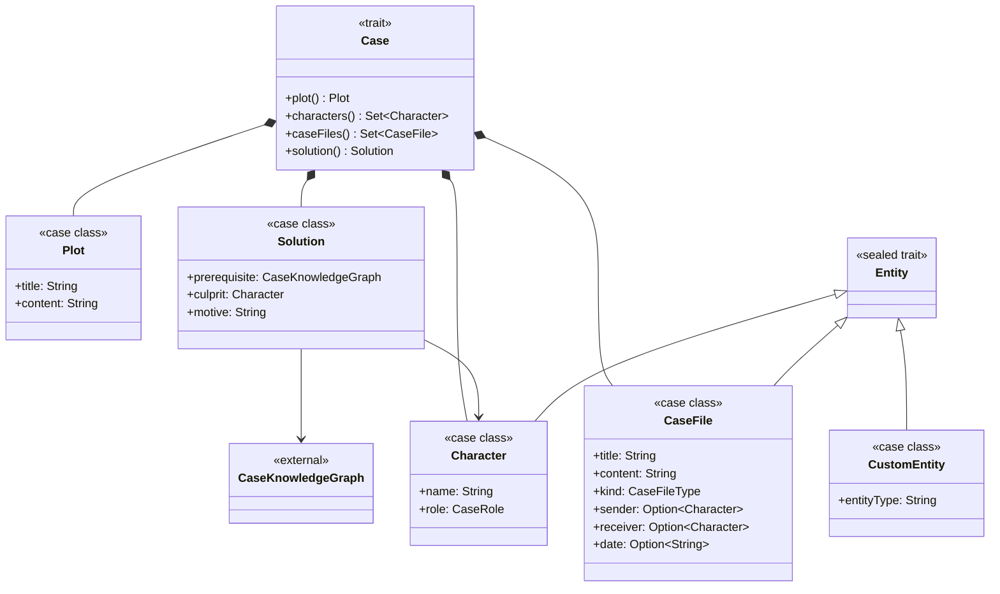
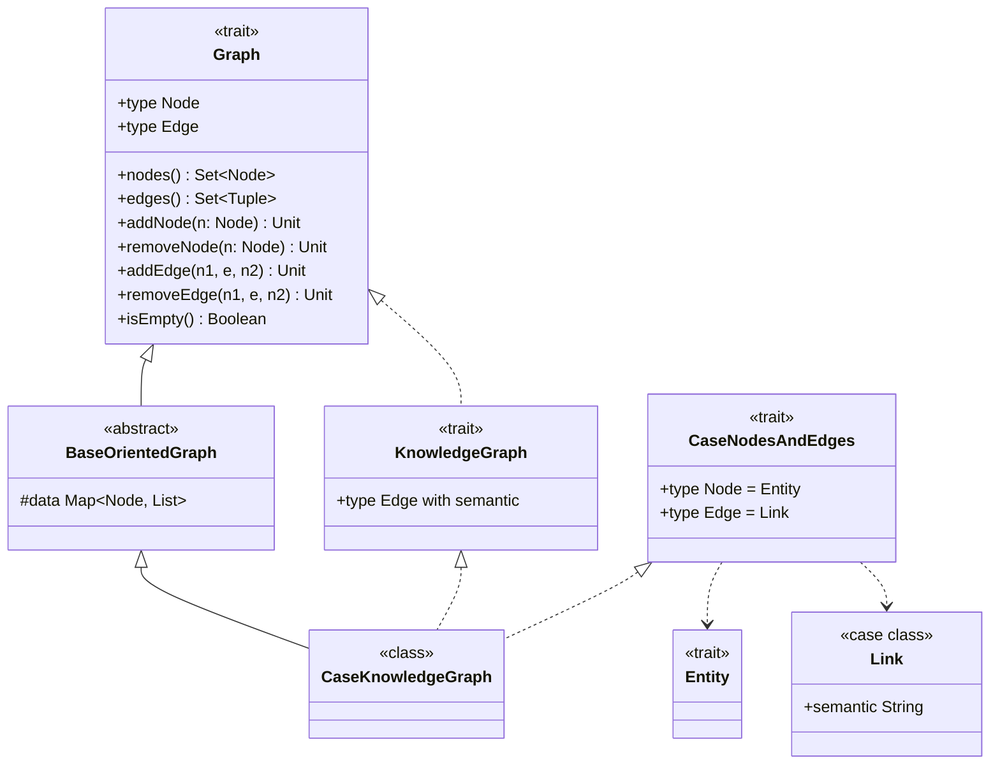
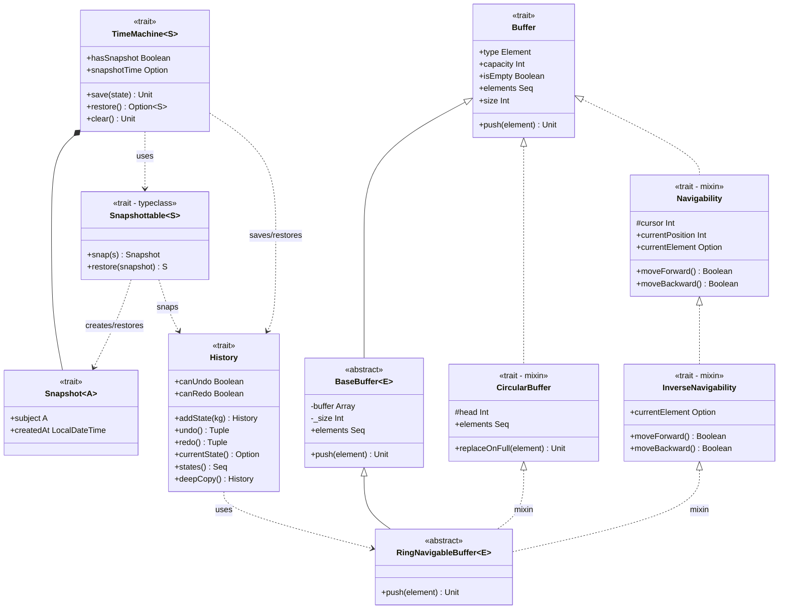
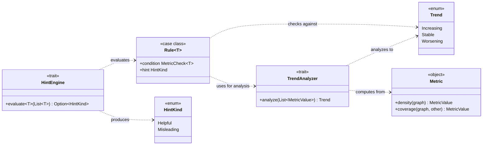
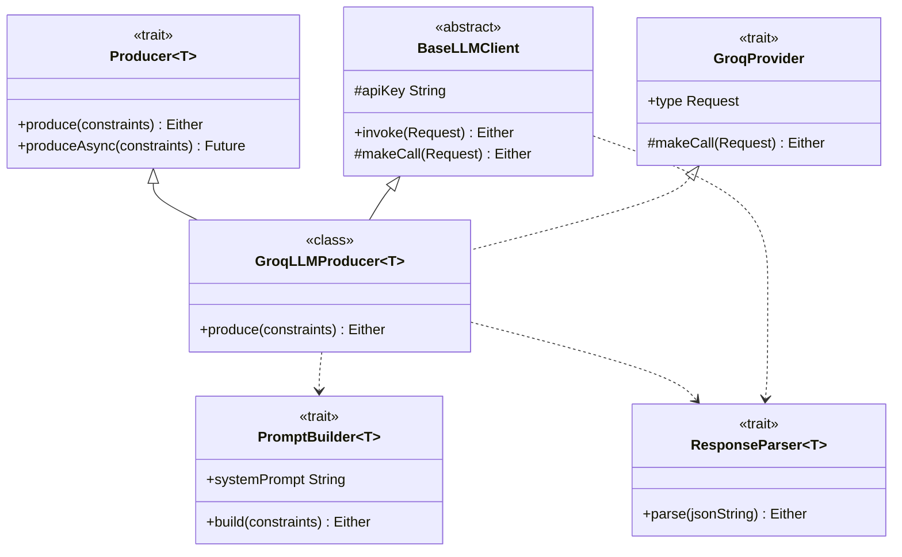

# Detailed Design

## Core Entities
The core of Whodunnit revolves around the `Case` entity. A `Case` is an aggregate data structure that encapsulates all the information for a single game session. It is composed of the following components:
- **Plot**: A narrative abstract of the mystery. This is presented to the player at the beginning of the game and remains accessible for reference throughout the investigation.
- **Characters**: A set of `Character` entities involved in the case. This collection includes suspects, witnesses, and the victim, as well as the culprit whom the player must identify.
- **CaseFiles**: A collection of investigative documents (e.g., emails, diaries, interview transcripts, reports) that the player must study and analyze to find clues and evidence.
- **Solution**:  The correct resolution to the mystery, which consists of the culprit (a `Character`) and their corresponding motive.

All these entities are modeled as Algebraic Data Types (ADTs) in Scala.

During gameplay, the player interacts with these models by constructing a `CaseKnowledgeGraph`. This graph serves as the player's "mental map" of the investigation. It is a visual representation of their understanding of the case, built from the information in the CaseFiles and the connections they have found or deduced.

This player-built graph is the primary mechanism for making an accusation. When a `Case` is procedurally generated, a corresponding prerequisite graph is also created. This hidden graph defines the key connections and knowledge points that a player must have represented in their own graph to make a valid and successful accusation against a character.

The prerequisite graph serves a dual purpose:
1. **Accusation Validation**: It acts as the benchmark against which the player's `CaseKnowledgeGraph` is compared when an accusation is made. The player's graph must satisfy the prerequisites defined in this solution graph.
2. **Progress Tracking**: The system continuously analyzes the player's graph against the prerequisite graph to measure how close they are to the solution. This metric is a key input for the dynamic hint system.

Nodes in the player's `CaseKnowledgeGraph` can be of three types: **Characters**, **CaseFiles**, or **Custom Entities**. Custom entities are user-created nodes that allow the player to add their own concepts, ideas, or items to the graph that are not explicitly defined in the case. These custom entities are not part of the prerequisite graph and serve only the player's organizational needs.

For the graph's edges, which represent connections, the player has complete freedom. The semantics of a connection are defined by the player using free-form text labels. This allows them to express any relationship they deduce, such as "is enemy of", "was seen with", "motive for" or "lied about."

## Knowledge Graph

The Knowledge Graph implementation is built using a flexible and extensible design based on the "family polymorphism" pattern.  This pattern allows for the definition of a family of types (the graph, its nodes, and its edges) that can be refined and concretized in successive steps.
The design is structured as follows:
1. `Graph`: At the base is a generic Graph trait. This trait defines the abstract concepts of `Node` and `Edge` as type members. It also specifies the contract for fundamental graph operations (e.g., addNode, removeNode, addEdge, edges).
2. `BaseOrientedGraph`: This abstract class extends the Graph trait and provides a concrete implementation for a directed graph, using an adjacency list representation. It implements the basic graph manipulation logic. However, at this level, the Node and Edge types remain abstract, as BaseOrientedGraph does not know what kind of nodes or edges it will store.
3. `KnowledgeGraph`: This is a mixin trait that provides a refinement for graph types. It extends Graph and introduces a constraint on the `Edge` type: any `Edge` in a `KnowledgeGraph` must contain a `semantic` property (a `String`), which represents the player-defined label for that connection.
4. `CaseNodesAndEdges`: This is another mixin trait whose sole purpose is to "fill in the blanks" for the abstract `Node` and `Edge` types. It defines the concrete `Node` type as `Entity` (which includes `Character`, `CaseFile`, and `Custom` Entity) and the concrete `Edge` type as `Link` (a data structure containing the semantic string).
5. `CaseKnowledgeGraph`: Finally, the concrete `CaseKnowledgeGraph` class is composed by mixing in all these components: it extends `BaseOrientedGraph` to get the core implementation, and mixes in both `KnowledgeGraph` (to enforce the semantic edge constraint) and `CaseNodesAndEdges` (to provide the concrete node and edge types). The result is a concrete, type-safe class that is an oriented graph where nodes are `Entitie`s and edges are `Link`s.

This design separates the graph's storage and operational logic (`BaseOrientedGraph`) from its domain-specific business rules (`KnowledgeGraph`) and its concrete data types (`CaseNodesAndEdges`), resulting in a modular and maintainable architecture.

## Versioning and Snapshots

To support the game's time-travel and versioning features, the system tracks player progress by saving the state of the `CaseKnowledgeGraph` every time a modification is made (e.g., adding a relation, creating a custom entity).

These states are stored in a `History` data structure. The `History` is a time-ordered collection of immutable graph states. It provides the core logic for `undo` and `redo` operations, allowing the player to move backward and forward through their investigation history one state at a time.

Parallel to this linear history, the game features a `Snapshot` system. A snapshot is a "photograph" of the game's state. More specifically, the snapshot is taken of the entire `History` data structure at a given moment. This allows the player to save a significant milestone in their investigation. At any time, the player can choose to restore a snapshot, which reverts the entire `History` (including all its past, present, and future states) to the exact condition it was in when the snapshot was taken.

Architecturally, the concept of snapshotting is implemented using a `Snapshot` type class. This design enables ad-hoc polymorphism: by defining `Snapshot` as a type class, any game element can be made "snapshot-able" simply by providing an implicit instance for it. In the current design, this capability is applied to the `History` structure, but it can be easily extended to other components of the game state.

## Hints

The game features a dynamic hint system that analyzes the player's progress and provides either `Helpful` or `Misleading` suggestions. This system is orchestrated by the `HintEngine` module.

The `HintEngine` operates by analyzing the player's `History`. At specific moments, it evaluates the sequence of `CaseKnowledgeGraph states stored in the history to understand the player's investigative trajectory.

The analysis process is as follows:
1. **Metric Calculation**: The engine first calculates a set of metrics for each state in the history. These metrics are defined in the `Metric` module and include calculations such as graph density, or coverage (i.e., how much of the player's graph overlaps with the solution's graph).
2. **Trend Analysis**: The resulting time-series of metric values is passed to the `TrendAnalyzer` module. This module contains different strategies (algorithms) to analyze the data and determine a `Trend` (e.g., `Increasing`, `Worsening`, or `Stable`) for one or more metrics.
3. **Rule Evaluation**: The core of the `HintEngine`'s decision-making is a set of `Rule`s defined in an internal Domain-Specific Language (DSL). These rules are generic and operate on the calculated trends, not on the raw data. A typical rule might be: "If coverage is Stable AND density is Increasing, then generate a Helpful hint."

Based on the evaluation of these rules, the `HintEngine` decides whether to generate a hint and what type it should be. This entire design is implemented using a purely functional approach, composing immutable data structures and pure functions for metrics.

## Generation

The system relies on procedural generation for two key game objects: the `Case` (including its plot, characters, files, and solution) and the `Hint` (both helpful and misleading).

To handle this in a generic way, the generation logic is abstracted using the `Producer[T]` type class. This enables ad-hoc polymorphism, allowing any game object `T` to be "producible" by providing an implicit `Producer` instance for it.

The implementation of these `Producer` instances leverages Large Language Models (LLMs) to generate dynamic and coherent content. The generation pipeline is designed to be modular and independent of any specific LLM provider.

1. **BaseLLMClient**: At the core is an abstract class, `BaseLLMClient`, which defines a provider-agnostic interface for making LLM inference requests.
2. **Provider Mixins**: To handle different LLM providers (e.g., OpenAI, Gemini, Anthropic), the architecture uses mixin traits. Each trait encapsulates the specific logic required to interact with a particular provider's API. A concrete client is created by composing the `BaseLLMClient` with the desired provider mixin. This modular, composition-based design makes the system highly extensible.
3. **PromptBuilder**: Before calling the client, a `PromptBuilder` component constructs a specific, formatted prompt tailored to the object being generated (e.g., a prompt to generate a `Case` with a specific theme, number of characters and documents, or a prompt to generate a misleading hint).
4. **ResponseParser**: The LLM's response is a JSON string. A `ResponseParser` component is responsible for parsing this string and deserializing it into the target Scala case class (e.g., `Case` or `Hint), ensuring the data is valid and type-safe.