# Solution Submission

## Overview

The solution submission system allows players to accuse a character as the culprit of the mystery. This feature implements a complete workflow from submission prerequisites validation to the final reveal of the solution, with proper state management throughout the MVC architecture.

## Implementation

### Model Layer

The model layer defines the core data structures for tracking submission state and validation results through enumerations.

#### SubmissionState Enum

The `SubmissionState` enum tracks the current state of the player's accusation submission:

```scala
enum SubmissionState:
  case NotSubmitted
  case Submitting(character: Character)
  case Submitted(result: ValidationResult)
```

- **NotSubmitted**: Initial state when no accusation has been made
- **Submitting**: Transient state while processing an accusation for a specific character
- **Submitted**: Final state containing the validation result

#### ValidationResult Enum

The `ValidationResult` enum represents the outcome of an accusation validation:

```scala
enum ValidationResult:
  case PrerequisitesNotMet
  case CorrectSolution(culprit: Character, motive: String)
  case IncorrectSolution(
      accusedCharacter: Character,
      actualCulprit: Character,
      motive: String
  )
```

- **PrerequisitesNotMet**: Player attempted to accuse before meeting the requirements
- **CorrectSolution**: Player correctly identified the culprit, including the motive
- **IncorrectSolution**: Player accused the wrong character, revealing both the accusation and the actual solution

#### SolutionConfig

Configuration constants for submission prerequisites:

```scala
object SolutionConfig:
  val PrerequisiteCoverageThreshold: Double = 1.0
  val TimeElapsedThreshold: Double = 0.85
```

- **PrerequisiteCoverageThreshold**: Required coverage (100%) of prerequisite knowledge to accuse
- **TimeElapsedThreshold**: Minimum time elapsed (85%) before allowing accusation

#### Validation Logic

The validation is performed by checking if the accused character matches the actual culprit:

```scala
object ValidationResult:
  def validateSolution(
      accusedCharacter: Character,
      solution: Solution
  ): ValidationResult =
    if accusedCharacter == solution.culprit then
      CorrectSolution(solution.culprit, solution.motive)
    else
      IncorrectSolution(accusedCharacter, solution.culprit, solution.motive)
```

### Controller Layer

The `GameBoardController` manages the submission workflow and prerequisite validation.

#### Prerequisite Validation

The `canAccuse` method determines if a player can make an accusation by checking two conditions (OR logic):

```scala
override def canAccuse: Boolean = (model.state.investigativeCase, model.state.currentGraph, model.state.timer) match
  case (Some(currentCase), Some(graph), Some(timer)) =>
    val prerequisitesMet =
      graph.coverage(currentCase.solution.prerequisite) >= SolutionConfig.PrerequisiteCoverageThreshold
    val timeThresholdMet = model.getRemainingTime match
      case Some(remaining) =>
        val elapsed = timer.totalDuration - remaining
        val elapsedPercentage = elapsed.toMillis.toDouble / timer.totalDuration.toMillis.toDouble
        elapsedPercentage >= SolutionConfig.TimeElapsedThreshold
      case None => false

    prerequisitesMet || timeThresholdMet
  case _ => false
```

The method leverages existing functionality:
- **Coverage calculation**: Uses the `coverage` metric from `Metric` to compare the player's knowledge graph against the case's prerequisite graph
- **Time tracking**: Uses the `Timer` component to calculate elapsed time percentage

#### Accusation Submission

The `submitAccusation` method orchestrates the submission process:

```scala
override def submitAccusation(character: Character): ValidationResult =
  model.updateState(_.withSubmissionState(SubmissionState.Submitting(character)))
  val result = validateSubmission(character)
  model.updateState(_.withSubmissionState(SubmissionState.Submitted(result)))
  model.state.timer.foreach(_.stop())
  result
```

Steps:
1. Update state to `Submitting` with the accused character
2. Validate if prerequisites are met
3. If met, validate the accusation; otherwise return `PrerequisitesNotMet`
4. Update state to `Submitted` with the result
5. Stop the game timer
6. Return the validation result

#### Available Suspects

The controller provides the list of characters that can be accused (all except the victim):

```scala
override def getAvailableSuspects: Set[Character] =
  model.state.investigativeCase.map(_.characters).getOrElse(Set.empty).filter(character =>
    !character.role.equals(CaseRole.Victim)
  )
```

### View Layer

The view layer implements the accusation and game end popups in `GameBoardScene`. Two modal popups are created:

- **Accusation Popup**: Displays a dropdown with available suspects and allows the player to submit their accusation
- **Game End Popup**: Shows the final result (win/lose message, culprit name, and motive)

## Workflow

1. **Player clicks Accuse button**: The view checks if `controller.canAccuse` is true
2. **Accusation popup appears**: Shows dropdown with available suspects (all characters except victim)
3. **Player selects character and submits**: 
   - Controller updates state to `Submitting`
   - Controller validates prerequisites
   - Controller validates accusation against solution
   - Controller updates state to `Submitted` with result
   - Controller stops timer
4. **Game end popup appears**: Shows win/lose message, culprit, and motive
5. **Game ends**: Timer is stopped, no further gameplay possible

## Design Decisions

### Reusing Existing Components

The implementation leverages existing model components:
- **Coverage metric**: The `coverage` extension method from `Metric.scala` calculates how much of the prerequisite graph the player has discovered
- **Timer**: The existing `Timer` component tracks elapsed time without modification
- **GameState**: Extended with `submissionState` field to track the submission workflow

### State Management

The `SubmissionState` enum provides clear state tracking:
- Prevents multiple simultaneous submissions
- Allows the View to display submission progress

### Prerequisites Logic

The OR condition for prerequisites (`prerequisitesMet || timeThresholdMet`) ensures:
- Skilled players can accuse early by discovering all clues
- All players eventually get a chance to accuse as time runs out
- The game remains accessible while rewarding thorough investigation

## Complete Class Diagram
A comprehensive class diagram illustrating the solution submission feature within the MVC architecture:

> **Note on UML Diagram**: the diagrams focus on the essential architectural elements and key methods that define the contracts between components. Helper methods, factory object methods, and internal implementation details are selectively omitted to emphasize the design patterns and polymorphic relationships. Complete method signatures and implementations can be found in the source code documentation.

```mermaid
classDiagram
    %% Model Layer
    class SubmissionState {
        <<enumeration>>
        NotSubmitted
        Submitting(character)
        Submitted(result)
    }

    class ValidationResult {
        <<enumeration>>
        PrerequisitesNotMet
        PrerequisitesMet
        CorrectSolution(culprit, motive)
        IncorrectSolution(accusedCharacter, actualCulprit, motive)
        +validateSolution(accusedCharacter, solution)$ ValidationResult
    }

    class SolutionConfig {
        <<object>>
        +PrerequisiteCoverageThreshold: Double
        +TimeElapsedThreshold: Double
    }

    class GameState {
        +investigativeCase: Option~Case~
        +history: Option~History~
        +timer: Option~Timer~
        +submissionState: Option~SubmissionState~
        +withSubmissionState(state) GameState
    }

    class CaseKnowledgeGraph {
        +nodes: Set~Node~
        +edges: Set~Edge~
        +coverage(other) Double
    }

    class Solution {
        +culprit: Character
        +motive: String
        +prerequisite: CaseKnowledgeGraph
    }

    class Case {
        +solution: Solution
        +characters: Set~Character~
    }

    class Timer {
        +totalDuration: Duration
        +stop() Unit
    }

    class Metric {
        <<object>>
        +coverage(other) Double
    }

    %% Controller Layer
    class GameBoardController {
        <<interface>>
        +canAccuse() Boolean
        +getAvailableSuspects() Set~Character~
        +submitAccusation(character) ValidationResult
    }

    class GameBoardControllerImpl {
        -model: Model
        +canAccuse() Boolean
        +getAvailableSuspects() Set~Character~
        +submitAccusation(character) ValidationResult
        -validateSubmission(accusedCharacter) ValidationResult
    }

    %% View Layer
    class GameBoardScene {
        -controller: GameBoardController
        -accuseButton: Button
        +showAccusationPopup() Unit
        +showGameEndPopup(hasWon) Unit
        -updateAccuseButton() Unit
    }

    %% Relationships
    GameState --> SubmissionState
    GameState --> ValidationResult
    GameState --> Case
    GameState --> Timer
    Case --> Solution
    Solution --> CaseKnowledgeGraph
    CaseKnowledgeGraph ..> Metric : uses
    
    GameBoardController <|.. GameBoardControllerImpl : implements
    GameBoardControllerImpl --> GameState : manages
    GameBoardControllerImpl --> ValidationResult : returns
    GameBoardControllerImpl --> SolutionConfig : uses
    GameBoardControllerImpl ..> Metric : uses coverage
    
    GameBoardScene --> GameBoardController : uses
    GameBoardScene --> ValidationResult : displays
```



*Figure 1: Solution submission complete class diagram*