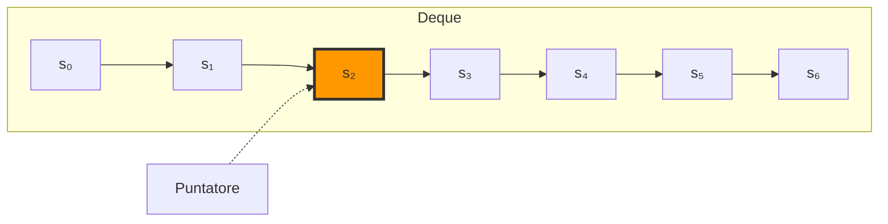
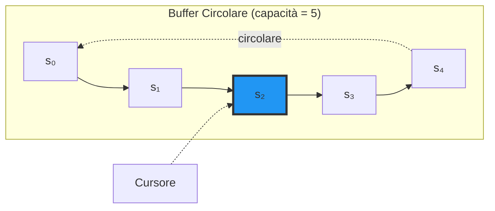

# Versioning System

I focused primarily on creating the application's **versioning system**, which forms the foundation for managing game history and undo/redo and time-travel functionalities.

## Design Rationale

Before proceeding with implementation details, it's important to understand the architectural choices that guided my versioning system design.
The design required careful analysis of trade-offs between different history management strategies, both at a conceptual level (_what to save_) and at a data structure level (_how to save_).

### Conceptual Approaches: State-Based vs Delta-Based

The first fundamental decision concerned the history representation strategy.
Two main approaches were considered:

#### 1. State-Based Approach

The **State-Based** approach involves saving the **complete graph state** at each player move.

**Characteristics**:
- **Read**: O(1) - the state is already fully computed and available
- **Write**: Requires serialization and saving of the entire state at each move
- **Memory**: Higher occupancy, as each snapshot contains the complete state

**Advantages**:
- Immediate access to any history state without computations
- Conceptual simplicity: each entry in history is self-contained
- Perfect adherence to application domain requirements

**Disadvantages**:
- Higher write cost (but amortized with efficient data structures)
- Greater memory usage compared to delta-based approach

#### 2. Delta-Based Approach

The **Delta-Based** approach involves saving a **base state** plus a **sequence of operations** (_deltas_) representing incremental changes.

**Characteristics**:
- **Read**: O(n) where n is the number of operations to apply - requires state reconstruction
- **Write**: O(1) - saves only the single operation/move
- **Memory**: Lower occupancy, as only differences are saved

**Advantages**:
- Extremely efficient writes
- Optimized memory for long move sequences

**Disadvantages**:
- Expensive reads: need to recalculate state by applying all operations from the base
- **Domain-specific problem**: In the Whodunnit application context, the `CaseKnowledgeGraph` is an integral part of the main view and must be **always available and updated**. This requirement negates the advantages of the delta-based approach, since it would still be necessary to reconstruct the graph state after each move to update the visualization.
- **Complexity with buffering**: Introducing a circular buffer with limited capacity adds an additional layer of complexity. With a delta-based approach, it would be necessary to track not only the moves, but also which of the k moves in the buffer are "applicable" at the current moment, significantly complicating management logic.

#### Optimization with Memoization

A possible optimization of the delta-based approach would have been using **memoization**: saving the recalculated state each time a read is performed, thus avoiding subsequent recomputations. However, given the need to update the view at each move, memoization would have been necessary **at each operation**, effectively making the approach equivalent to state-based in terms of computational and memory costs.

#### Final Choice: State-Based

Considering the application's specific requirements, the **State-Based approach** was chosen. This choice is motivated by:

1. **View requirements**: The graph must always be available for visualization
2. **Implementation simplicity**: Elimination of complexity related to delta management and their application
3. **Performance predictability**: All operations have constant or amortized constant complexity
4. **Alignment with functional principles**: Immutable state naturally lends itself to being saved and restored in its entirety

### Data Structure Choice

Once the state-based approach was defined, it was necessary to select the optimal data structure to implement history with undo/redo functionality. Several alternatives were evaluated:

#### Option 1: Current State + Two Lists

**Structure**: Current state + list of previous states + list of next states


**Complexity analysis**:
- **Current state access**: O(1)
- **Undo**: O(1) - movement between lists
- **Redo**: O(1) - movement between lists
- **Insertion**: O(n) - list insertion may require reallocation

**Reason for rejection**: Linear insertion costs make this solution suboptimal for an interactive application where operations must be responsive.

#### Option 2: Deque + Pointer

**Structure**: Deque (double-ended queue) containing all states + pointer to current position



**Complexity analysis**:
- **Head/tail insertion**: O(1)
- **Index access**: O(n) - requires structure scanning
- **Undo/Redo**: O(n) - pointer movement requires indexed access

**Reason for rejection**: Index access with linear complexity makes navigation operations (undo/redo) inefficient, compromising user experience.

#### Option 3: Navigable Circular Buffer (Implemented Choice)

**Structure**: Circular buffer with fixed capacity + inverse navigation cursor



**Complexity analysis**:
- **Push (state addition)**: O(1) amortized
- **Current state access**: O(1)
- **Undo/Redo**: O(1) - cursor movement
- **Overwrite when full**: O(1) - circular behavior

**Advantages**:
- **Optimal performance**: All critical operations have O(1) amortized complexity
- **Automatic memory management**: The circular buffer automatically limits the number of states maintained, avoiding unlimited growth
- **Natural integration with undo/redo**: The inverse navigation cursor allows efficient forward and backward movement through history
- **Intuitive behavior**: When adding a new state after performing undo, the "future history" is automatically discarded, standard behavior for undo/redo systems

**Implementation**: This solution was implemented through the `RingNavigableBuffer`, which combines:
- `CircularBuffer`: for circular behavior
- `InverseNavigability`: for navigation with cursor that accesses elements from most recent to oldest
- Custom push logic: manages interaction between cursor and insertion

#### Comparison Table

| Data Structure | Push | Current Access | Undo/Redo | Choice |
|---------------|------|----------------|-----------|---------|
| State + 2 Lists | O(n) | O(1) | O(1) | ❌ |
| Deque + Pointer | O(1) | O(n) | O(n) | ❌ |
| **Navigable Circular Buffer** | **O(1)*** | **O(1)** | **O(1)** | **✅** |

*amortized

### Design Rationale Conclusions

The design choices made led to a versioning system that effectively balances:
- **Performance**: O(1) complexity for all critical operations
- **Memory**: Automatic management through circular buffer with limited capacity
- **Domain requirements**: Perfect alignment with view needs and user experience
- **Functional principles**: Immutability of the public interface with implementation efficiency

This architecture attempts to use a **pragmatic design** approach that aims to apply functional programming principles without sacrificing the performance required by an interactive application.

## Package `model.versioning`

The `versioning` package contains the fundamental abstractions for managing snapshots and buffers, implemented using functional programming patterns.

### Snapshot

The **snapshot** system uses **ad hoc polymorphism** implemented through **type classes**, leveraging Scala 3 features (`given`/`using`).

```scala
trait Snapshot[+A]:
  def subject: A
  def createdAt: LocalDateTime

trait Snapshottable[-S]:
  def snap[T <: S](s: T): Snapshot[T]
  def restore[T <: S](snapshot: Snapshot[T]): T
```

The architecture is based on two main components:

1. **`Snapshot[+A]`**: contravariant trait representing an immutable snapshot of state `A` at a precise moment in time
2. **`Snapshottable[-S]`**: type class defining the contract for making a type `S` "snapshottable"

The separation between the data (`Snapshot`) and the ability to create/restore it (`Snapshottable`) represents an example of **separation of concerns** (**Single Responsibility Principle**).
This approach allows:

- Extending the snapshot system to new types without modifying existing code (**Open/Closed Principle**)
- Defining different snapshot strategies for the same type through different `given` instances
- Maintaining **immutability** as a type-guaranteed invariant

#### Given Instances and Context Bounds

The implementation uses **given instances** to automatically provide `Snapshottable` implementations:

```scala
object Snapshotters:
  given Snapshottable[History] with
    override def snap[T <: History](history: T): Snapshot[T] =
      SnapshotImpl(history.deepCopy().asInstanceOf[T], LocalDateTime.now())

    override def restore[T <: History](snapshot: Snapshot[T]): T =
      snapshot.subject.deepCopy().asInstanceOf[T]
```

The use of **context bounds** (`[S: Snapshottable]`) allows expressing type requirements concisely:

```scala
def apply[S: Snapshottable](s: S, timestamp: LocalDateTime = LocalDateTime.now): Snapshot[S] =
  summon[Snapshottable[S]].snap(s)
```

This design ensures that only types for which a `Snapshottable` instance exists can be passed to these functions, with **compile-time** checking.

#### Deep Copy and Snapshot Isolation

A crucial aspect of the implementation is the use of **deep copy** to guarantee complete isolation between snapshots and the original object. This is fundamental to preserving **semantic immutability**: even if the original object were modified (in the case of structures with internal mutable components), the snapshot remains unchanged.

### Buffer
For the **buffer** system, the principles of **family polymorphism** were used through trait composition with **self-types** and **mixin linearization**.

#### Modular Architecture

The design is based on a hierarchy of composable traits:

```scala
trait Buffer:
  type Element
  val capacity: Int
  def isEmpty: Boolean
  def elements: Seq[Element]
  def push(element: Element): Unit
  // ...
```

The `Buffer` trait defines an **abstract type member** `Element`, allowing each implementation to specialize the type of contained element.

#### Base Buffer: Base Implementation

```scala
abstract class BaseBuffer[E](override val capacity: Int)(using reflect.ClassTag[E]) 
  extends Buffer:
  type Element = E
  private val buffer: Array[Option[E]] = Array.fill(capacity)(None)
  protected var _size: Int = 0
```

`BaseBuffer` provides the base implementation with:
- Internal storage through `Array[Option[E]]` to handle empty positions
- Use of `ClassTag[E]` to create arrays of generic types (for runtime reflection)
- Encapsulated *mutable* state (`private val buffer`, `protected var _size`)

#### Circular Buffer: Ring Behavior

```scala
trait CircularBuffer extends Buffer:
  protected var head: Int = 0

  abstract override def replaceOnFull(element: Element): Unit =
    set(head, element)
    head = (head + 1) % capacity
```

The `CircularBuffer` trait introduces **circular/ring** behavior: when the buffer is full, elements are overwritten in circular mode. The use of `abstract override` is fundamental for **mixin linearization**: this keyword combination indicates that the trait **depends** on an implementation provided by another component in the linearization chain (in this case `BaseBuffer`), but at the same time **overrides** that implementation to enrich it with new behavior. Without `abstract`, the compiler would consider the implementation as complete and autonomous, losing the type-safety guarantees that require the presence of a concrete base to operate on.

#### Navigability: Navigation Cursor

```scala
trait Navigability:
  self: Buffer =>
  
  protected var cursor: Int = 0
  
  def moveForward(): Boolean =
    if cursor < size - 1 then
      cursor += 1
      true
    else false
```

The `Navigability` trait introduces a **cursor** to navigate between buffer elements.
The **self-type** `self: Buffer =>` indicates that the trait can only be mixed in with types that are (or extend) `Buffer`, guaranteeing access to `size` and other members.

#### Inverse Navigability: Navigation Direction Inversion

```scala
trait InverseNavigability extends Navigability:
  self: Buffer =>

  override def currentElement: Option[Element] =
    if isEmpty then None
    else Some(elements(size - 1 - cursor))

  override def moveForward(): Boolean = super.moveBackward()
  override def moveBackward(): Boolean = super.moveForward()
```

`InverseNavigability` uses **method overriding** to invert navigation semantics: forward becomes backward and vice versa, with element access from most recent to oldest.

#### Ring Navigable Buffer: Complete Composition

```scala
abstract class RingNavigableBuffer[E](override val capacity: Int)(using reflect.ClassTag[E])
  extends BaseBuffer[E](capacity) 
  with CircularBuffer 
  with InverseNavigability
```

`RingNavigableBuffer` combines all behaviors through **mixin composition**, using **family polymorphism**: each trait brings a "family" of functionalities that are linearized, creating a single coherent type with complex behavior.

The override of the `push` method in this class handles the interaction between the navigation cursor and the circular buffer, implementing the logic that when adding an element while the cursor is not at the beginning, **the "future" history is discarded** (typical behavior of an undo/redo system).

## History: Game Timeline

The `History` component is the high-level abstraction that manages game state history, implementing undo/redo functionality.

```scala
trait History:
  def addState(kg: CaseKnowledgeGraph): History
  def undo(): (History, Option[CaseKnowledgeGraph])
  def redo(): (History, Option[CaseKnowledgeGraph])
  def currentState: Option[CaseKnowledgeGraph]
  def deepCopy(): History
```

### Immutability and Functional Transformations

A fundamental aspect of `History` is respect for the principle of **immutability**: each operation (`addState`, `undo`, `redo`) does not modify the existing instance, but returns a **new** instance of `History`:

```scala
override def addState(kg: CaseKnowledgeGraph): History =
  val newBuffer = cloneBuffer()
  newBuffer.push(kg)
  GameHistory(historySize, newBuffer)
```

This allows maintaining references to previous states without risk of unexpected modifications and easily implementing snapshot and restore of the entire history.


### Integration with Buffer

`GameHistory` internally uses a `RingNavigableBuffer[CaseKnowledgeGraph]`, integrating:
- Circular behavior to limit memory usage
- Inverse navigability to move through history
- Cursor to track current position

```scala
case class GameHistory(
  private val historySize: Int,
  private val timeline: RingNavigableBuffer[CaseKnowledgeGraph]
) extends History
```

Encapsulating the buffer as a `private` field ensures that internal mutability is controlled and not exposed to `History` clients, maintaining the **immutable interface** despite the underlying mutable implementation.

## TimeMachine: Snapshot Management

The `TimeMachine` component provides **save/restore** functionality based on the snapshot system.

```scala
trait TimeMachine[S]:
  def save(state: S): Unit
  def restore(): Option[S]
  def hasSnapshot: Boolean
  def clear(): Unit
  def snapshotTime: Option[LocalDateTime]
```

### Implementation with Type Classes

```scala
case class GameTimeMachine[S: Snapshottable](
  private var currentSnapshot: Option[Snapshot[S]] = None
) extends TimeMachine[S]:

  override def save(state: S): Unit =
    currentSnapshot = Some(Snapshot(state))

  override def restore(): Option[S] =
    currentSnapshot.map(Snapshot.restore)
```

The **context bound** `[S: Snapshottable]` ensures that only types for which a `Snapshottable` instance exists can be used with `GameTimeMachine`.
Thanks to **constraints propagation** the constraint is propagated at compile-time through all calls.

The use of `Option[Snapshot[S]]` to represent the presence/absence of a snapshot avoids null and makes the **possibility of data absence explicit**.

## Testing: Complete System Validation

For each component of the versioning system I implemented complete test suites using **ScalaTest** with the `AnyWordSpec` style.

### Tests for Snapshot

Tests for `Snapshot` validate:
- Correct creation of snapshots for primitive and complex types
- **Isolation** between snapshot and original object
- Correct state restoration
- Handling of mutable and immutable objects

```scala
"not be affected by subsequent changes" in:
  val history = MutableHistory(new Array(5))
  history.add(3)
  val snapshot = Snapshot(history)
  history.add(3)
  
  snapshot.subject.elements should contain only 3
```

### Tests for Buffer

Buffer tests cover:
- All buffer variants (base, circular, navigable, inverse navigable, ring navigable)
- Interactions between different behaviors through mixins
- Edge cases (empty buffer, full buffer, navigation at limits)

```scala
"elements pushed when cursor is not in initial position" should:
  val buffer = RingNavigableBuffer[Int](ringNavigableMaxSize)
  buffer.push(1)
  buffer.push(2)
  buffer.push(3)
  buffer.moveBackward() // cursor at 1, current element 2
  buffer.moveBackward() // cursor at 2, current element 1
  buffer.push(4) // should push and decrease size
```

### Tests for History and TimeMachine

Tests validate:
- Undo/redo behavior in various sequences
- Immutability of operations
- Correct deep copy handling
- Integration with snapshot system
- `canUndo` and `canRedo` flags

## Functional Programming Principles Applied

The versioning system implementation uses the following functional principles:

1. **Ad Hoc Polymorphism**: The `Snapshot`/`Snapshottable` system uses type classes and given instances for type-safe extensibility
2. **Family Polymorphism**: Buffers demonstrate behavior composition through traits, self-types, and linearization
3. **Immutability**: `History` maintains a completely immutable interface despite the internal mutable implementation
4. **Higher-Order Types**: Abstract type members (`type Element`) for design flexibility
5. **Pure Functions**: Separation between computation and side effects where possible